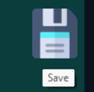

# Contact Management Application

An efficient application for managing contacts, developed with a focus on rapid application development. This app allows users to view, search, categorize, and manage their contacts with ease.

---

## Table of Contents

- [Introduction](#introduction)
- [Forms Overview](#forms-overview)
- [Functionality](#functionality)
- [Screenshots](#screenshots)
- [Installation](#installation)
- [Usage](#usage)
- [License](#license)

---

## Introduction

Created at the **University of Piraeus, Department of Informatics**, this project demonstrates rapid application development principles through a contact management tool. Users can quickly organize contacts into groups, perform real-time searches, and edit contact details via an interactive interface. The application is structured with three main forms to facilitate easy contact management.

---

## Forms Overview

The application consists of three primary forms:

1. **Address Book** - Main view showing all contacts.
2. **Contact Display Form** - View and edit individual contact details.
3. **Add Contact Form** - Add new contacts to the list.

Each form provides a unique functionality and is interconnected with the other forms, ensuring a smooth user experience.

---

## Functionality

### Address Book


The **Address Book** serves as the main screen, displaying all contacts and enabling search by name or by group.

**Functionality**:
1. **View All Contacts**: Displays a comprehensive list of contacts.
2. **Sample Contact View**: Allows the user to double-click a contact to view details (as indicated by the label).
3. **Search by Name**: Enter part of a contact's name for a case-insensitive, real-time search.
4. **Search by Group**: Filter contacts by their group (e.g., Family, Friend, Work) for quick access.
5. **Add New Contact**: Opens the Add Contact form in a new window.
6. **Exit Application**: Provides an option to safely close the application.

**Connectivity**: The Address Book connects with both the Contact Display and Add Contact forms for seamless navigation across the application's features.

### Contact Search

- **By Name (Right Side)**: The program connects to the database to retrieve matching results, with flexibility in partial name searches. The list dynamically updates as characters are typed.
- **By Group (Left Side)**: An added feature that enhances user experience by grouping contacts (Family, Friend, Work). Activating one search type automatically disables the other to prevent conflicts and restores the full contact list.

---

### Contact Display Form


The **Contact Display Form** is opened by double-clicking on a contact in the Address Book, displaying the following contact details:

1. **Name**
2. **Phone Number**
3. **Address**
4. **Email**
5. **Date of Birth**
6. **Group** (e.g., Family, Friend, Work)
7. **Delete Contact**: Permanently removes the contact from the list.
8. **Exit**: Closes the form and returns to the Address Book.

**Editable Fields**: Double-click any field to edit it directly.
  
#### Editing Options:
1. **Change Name**: Text input field for name editing.
2. **Change Birthdate**: Date input field.
3. **Change Group**: Dropdown selection for group type.
4. **Save Changes**: Appears upon editing to save changes and close the form.

**Connectivity**: This form only connects with the Address Book, enabling users to return to the main screen after viewing or editing a contact.

### Add Contact Form


The **Add Contact Form** provides a straightforward way to add new contacts with essential details.

**Form Fields**:
1. **Basic Contact Details**: Fields for name, phone number, email, address, and date of birth.
2. **Group Selection**: Select a group (Family, Friend, Work) to categorize the contact.
3. **Save and Close**: Adds the contact to the Address Book and closes the form.
4. **Exit Without Saving**: Closes the form without adding the contact.

**Connectivity**: This form connects exclusively with the Address Book, ensuring that newly added contacts appear immediately upon returning to the main screen.

### Interactive UI Features

- **Visual Cues**: Cursor changes, color highlights, and informative labels guide users through interactive features.

         

- **Exit Prompts**: Users receive a confirmation message if they attempt to exit a form without saving, helping prevent accidental data loss.


---

## Installation

1. Clone the repository:
    ```bash
    git clone https://github.com/username/contact-management-app.git
    cd contact-management-app
    ```

2. Install dependencies:
    ```bash
    npm install
    ```

3. Start the application:
    ```bash
    npm start
    ```

> **Note**: Ensure that a compatible database is set up and configured in `config/database.js`.

---

## Usage

### Address Book
1. **View Contacts**: All contacts are displayed on the main screen.
2. **Search**:
   - **By Name**: Type a name in the right-side search bar for real-time results.
   - **By Group**: Select a group on the left side to filter contacts.
3. **Add Contact**: Opens a form for adding new contacts.

### Contact Display Form
1. **View Details**: Double-click a contact in the Address Book to open.
2. **Edit Contact**: Double-click any field to edit (Name, Date of Birth, etc.).
3. **Delete Contact**: Remove a contact directly from this form.

### Add Contact
1. Open the Add Contact form through the Address Book.
2. Input required details and select a group.
3. Save to add the contact or exit without saving.

---

## License

This project is licensed under the MIT License - see the [LICENSE](LICENSE) file for details.

---

## Acknowledgements

- **University of Piraeus**, Department of Informatics, for project guidance.
- Open-source contributors for libraries used in development.
